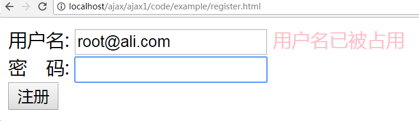

# Ajax 技术

## 案例---新用户注册时用户名冲突问题

## 传统模式解决方案

1) 在注册页面中输入用户名和密码，点击“注册”时，要将表单数据提交给后台

2) 后台PHP页面，接收用户名和密码之后，要去验证用户名是否存在，如果存在则提示用户名存在，再跳转回注册页面，重新输入。

  当用户名存在时，提示用户名已被占用，再跳转回登录页

## ajax解决方案

当光标离开用户名文本框时，就已经验证了用户名是否存在，并给予提示了。

  用户名被占用： 

用户名可用 :

> 两种模式对比

传统模式： 

  两个页面 ---  前端注册表单页（index.html）  和  后端数据验证页（index.php）

Ajax模式 :

  两个页面 --- 前端注册表单页（index.html）  和  后端数据验证页（index.php）

Ajax的优势：没有页面跳转，刷新页面内容，用户体验提升。

ajax就是在页面没有刷新或者没有跳转的情况下还能更新页面的某一部分数据

