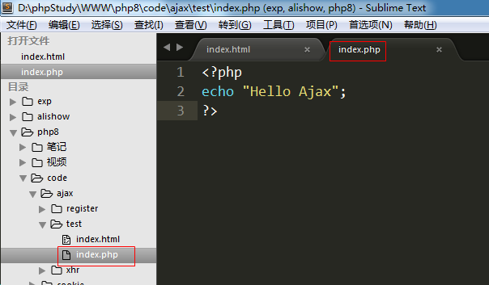

# Ajax入门

## （Ajax 开发）概述

Ajax 即“Asynchronous Javascript And XML”（异步 JavaScript 和 XML），是指一种创建交互式网页应用的网页开发技术。

Ajax = 异步 JavaScript 和 XML（标准通用标记语言的子集）。

Ajax 是一种用于创建快速动态网页的技术。

Ajax 是一种在无需重新加载整个网页的情况下，能够更新部分网页的技术。

通过在后台与服务器进行少量数据交换，Ajax 可以使网页实现异步更新。这意味着可以在不重新加载整个网页的情况下，对网页的某部分进行更新。
传统的网页（不使用 Ajax）如果需要更新内容，必须重载整个网页页面。

  历史：

1999年诞生，微软在IE5中集成了XMLHttpRequest对象，但是并没有受到人们重视。

2005年，google在gtalk即时聊天工具中使用了该对象，从此之后Ajax技术开始受到人们的重视。

## 发送Ajax请求

### ajax核心对象 --- XMLHttpRequest对象

创建XMLHTTPRequest对象要分为(低版本) IE和==非IE两种方式(主流)==：

   IE浏览器（IE7之前） :  

                  var xhr = new ActiveXObject('Msxml2.XMLHTTP');

   非IE浏览器（chrome、firefox、safair、搜狗等，包括IE7+之后） (主流浏览器):

		  var xhr = new XMLHttpRequest();

案例：创建XMLhttpRequest对象，兼容IE7之前和主流浏览器

        //创建XMLHttpRequest对象，兼容低版本IE和非IE浏览器
        function getXhr () {
            var xmlhttp;

            if (window.XMLHttpRequest) {
                //IE7+ 和 非IE 中都有 XMLHttpRequest对象
                xmlhttp = new XMLHttpRequest();
            } else {
                xmlhttp = new ActiveXObject('Msxml2.XMLHTTP');
            }

            return xmlhttp;
        }

        alert(getXhr());

chrome访问结果:

IE访问结果:

## 核心方法

XMLHttpRequest对象有了，可以发送Ajax请求了。发送请求需要两个方法:

open(var1, var2, var3): 准备Ajax请求

        var1: 请求方式  get/post
        var2: 请求的后端程序地址
        var3: 异步(true)/同步(false)，可选参数，默认为true

  示例: xhr.open(‘get’, ‘index.php’);   //准备以get方式请求后端的index.php文件

   send(var): 发送Ajax请求

        var: 分为两种情况。 如果是get请求，则填写null。 如果是post请求，则填写要发送到后端的数据。

 var: 分为两种情况。 如果是get请求，则填写null。 如果是post请求，则填写要发送到后端的数据。

    示例: xhr.send(null); 

## 发送请求案例

 在index.html页面上创建按钮，点击该按钮时使用get方式请求后端的index.php页面

 发送Ajax请求流程:

   1) 创建XMLHttpRequest对象

   2) 调用open方法准备ajax请求

   3) 调用send方法发送ajax请求

代码实现

   1) 创建按钮，绑定点击事件

   2) 创建XMLHttpRequest对象

   3) 调用open方法准备ajax请求

   4) 调用send方法发送ajax请求

 访问结果: --- 通过newwork来确定请求是否发出

点击"btn"时，又发送了请求，请求了 index.php文件，并且正常接收到结果

## 接收后端响应结果

### 核心属性 --- readyState

Ajax的整个过程有5个状态，对应readyState的5个值：0-4

    《Pragmatic Ajax A Web 2.0 Primer 》 中对readyStae状态的介绍 

   0: (Uninitialized) the send( ) method has not yet been invoked.  

   1: (Loading) the send( ) method has been invoked, request in progress.  

   2: (Loaded) the send( ) method has completed, entire response received. 

   3: (Interactive) the response is being parsed. 

   4: (Completed) the response has been parsed, is ready for harvesting.  

   0 － （未初始化）还没有调用send()方法 

   1 － （载入）已调用send()方法，正在发送请求 

   2 － （载入完成）send()方法执行完成，已经接收到全部响应内容 

   3 － （交互）正在解析响应内容 

   4 － （完成）响应内容解析完成，可以在客户端调用了 

百度百科: 

  0 （未初始化） 	对象已建立，但是尚未初始化（尚未调用open方法）               

  1 （初始化）  	已调用send()方法，正在发送请求                      

  2 （发送数据） 	send方法调用完成，但是当前的状态及http头未知              

  3 （数据传送中）  已接收部分数据，因为响应及http头不全，这时通过responseBody和responseText获取部分数据会出现错误，

  4 （完成）   	数据接收完毕，此时可以通过通过responseBody和responseText获取完整的回应数据

 

- **最核心的重点：   4 ,  后端返回的数据已经可以在浏览器中使用了。**

## 核心事件 --- onreadystatechange

 onreadystatechange事件:  readyState的值每次发生变化都会触发该事件。

    0-->1    1-->2    2-->3    3-->4 总共触发4次

### 其他重要属性

 responseText：以字符串形式接收后端程序的返回值。

         以PHP为例: PHP程序最终会被解释程序一段字符串，responseText接收的就是这段字符串

     responseXML：以XML格式接收后端程序返回值

### 响应案例 --- index.php

index.php：返回字符串“Hello Ajax”给前端 --- 就是  echo "Hello Ajax"

     index.html： 将Hello Wrold 显示在页面的div中

1) index.php 返回一个字符串（Hello Ajax！！）

2) 在index.html中检测readyState的状态，当readyState状态等于4的时候，使用responseText来接收后端返回的数据

responseText本质是接收后端返回的字符串。

Ajax程序总结

一般我们编写Ajax程序时需要两个页面，三大步骤:

  两个页面:

   前端静态html页面 (php页面也行)，用来发送ajax请求，将结果渲染到页面上

   后端php页面 (jsp、asp也行)，用来接收前端请求，处理数据，并将结果返回给前端页面

 

  三大步骤:

  1) 前端静态页面发送ajax请求。

  ① 创建 XMLHttpRequest 对象

       ② 调用open方法准备ajax请求

       ③ 调用send方法发送ajax请求

       ④ 调用onreadystatechange事件，判断readyState=4时，使用responseText接收后端返回数据

        2) 后端php页面，处理请求并返回结果

        3) 前端页面接收结果，显示在网页指定位置

### 综合案例

点击按钮，从student表中随机取出一条学生信息，显示在网页上。

 思路分析:

 1) 两个页面

   前端静态页面: student/index.html

   后端php页面: student/index.php

 

 2) 三大步骤

  ① index.html 页面设置一个按钮，用来触发ajax请求

  ② index.php 随机取出一条学生数据，并返回给index.html页面

    $sql = "select * from student order by rand() limit 0,1";

  ③ index.html 接收到后显示在页面上

   代码实现:

第一步骤:  index.html页面发送ajax请求

第二步骤: 后端php页面

第三步骤： index.html -- 将接收到的数据渲染到页面

 关键点总结:

1) index.html 通过点击事件发送ajax请求

 ① 创建XMLHttpRequest对象

 ② 调用open方法准备ajax请求

 ③ 调用send方法发送ajax请求

**此时不要着急将数据渲染到网页上**

 2) index.php 随机取出一条学生数据，并返回给index.html页面

  ① mysqli操作MySQL服务器的6步骤

  ② 核心SQL:  select * from student order by rand() limit 0,1 

  ③ 将结果拼接成字符串再输出，因为前端是以字符串形式接收的

 3) index.html接收到后显示在页面上

  ① 创建一个div标签，用来显示接收到数据

  ② 获取div对象，再将数据显示到该标签中

