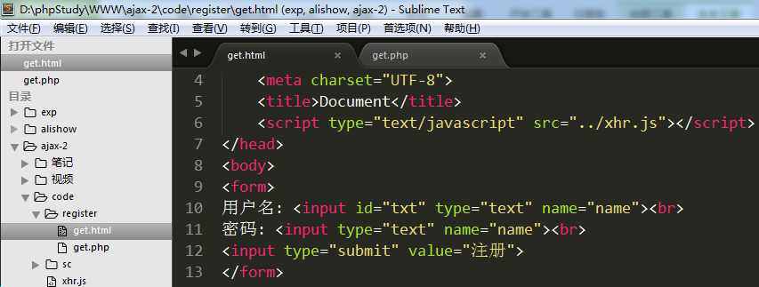
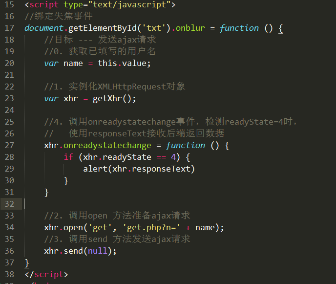
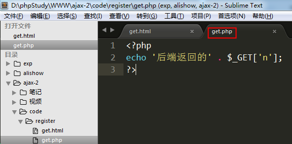
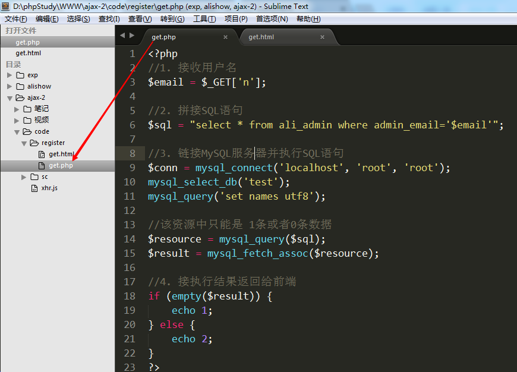
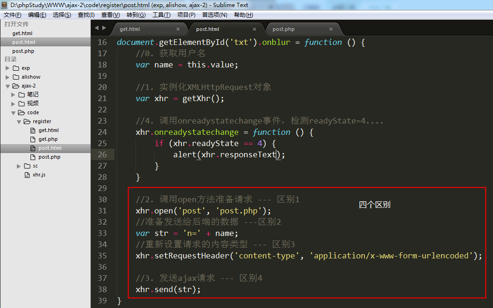

# POST和GET的区别
## GET方式实现新用户注册---用户名检

 步骤:

1. get.html

       1) 在用户名文本框上绑定失焦事件(onblur)

       2) 失焦事件函数

            ① 获取用户名文本框内已填写的用户名

            ② 发送ajax请求，并将已填写的用户名一起发送给后端php页面

1. get.html

        1) 接收后端返回的数据，判断是1还是2。

        2) 如果等于1，则提示用户名可用；如果等于2，提示用户名被占用

代码实现:

1. get.html

        1) 在用户名文本框上绑定失焦事件(onblur)

        2) 失焦事件函数

                ① 获取用户名文本框内已填写的用户名

                ② 发送ajax请求，并将已填写的用户名一起发送给后端php页面

 先测试一下前后端的连通性:

 

2. get.php

        1) 接收前端发送过来的用户名
        2) 模拟用户被占用的情况 
        3) 将结果返回给前端（1用户名可用   2用户名被占用）

       

3. get.html

        1) 接收后端返回的数据，判断是1还是2。

        2) 如果等于1，则提示用户名可用；如果等于2，提示用户名被占用

关键点总结:

1. 用户名文本框绑定失焦事件

2. 发送ajax请求基本属于流程化操作
   1) 实例化XMLHttpRequest对象
   2) 调用open方法准备请求，**get方式发送将数据拼接在url地址之后即可**
     xhr.open('get',  'get.php?**n='+name**);
   3) 调用send方法发送请求，**get方式只需要将 null  作为参数传入即可**
   4) 调用onreadystatechange事件，在readyState=4时使用responseText接收返回值。此步使用alert或者console.log先输出接收的结果即可，**不要着急将结果显示在网页上**。

3. 创建后端php程序，接收用户名进行验证
   核心SQL:  select * from ali_admin where admin_email = '$name';
   该SQL语句的执行结果只可能是两种： 0条数据    1条数据(因为admin_email字段唯一)
     0条数据: 说明没有该用户名 （没有被占用）
     1条数据: 说明已存在该用户名 （已被占用）
   根据SQL执行结果返回1或者2，1代表未被占用，2代表已被占用

4. 修改get.html文件，将结果显示在网页上
   获取用来显示结果的span标签，判断接收的结果为1还是2。如果为1，则将用户名可用写入span标签；反之，则将用户名已被占用写入span标签

## POST方式实现新用户注册---用户名检测

post和get两种方式的整体思路一致，只是细节上有所差别

 1) 使用open准备请求时，参数1需要设置为post，参数2只需要设置后端程序地址。

 2) 将需要传递到后端的数据拼接成一个独立的字符串，字符串的格式为

        var str = ‘key=value&key=value&....’;    （内部结构跟get传参时的结构一致）

 3) 调用setRequestHeader方法将数据格式转为 application/x-www-form-urlencoded

 4) 将拼接好的数据字符串作为参数传入send方法

 5) 后端的php程序需要使用 $_POST来接收数据

前端的区别:

后端的区别:

> 关键点总结:

 1) 发送程序时，参数1设置为post，参数2只用设置请求的后端文件路径

    xhr.open('post', 'post.php');

 2) 将需要传递到后端的数据拼接成一个独立的字符串

  var str = 'name='+name; 

 3) 调用setRequestHeader方法将数据格式转为 application/x-www-form-urlencoded

    xhr.setRequestHeader('content-type', 'application/x-www-form-urlencoded');

 4) 发送请求时，要将之前拼接好的字符串作为参数放入send方法中

    xhr.send(str);

> 补充说明 --- 实际验证用户名是否存在的方法

核心：  $sql = "select * from ali_admin where admin_email='$username'";

该SQL语句要么查询出1条数据，要么查询出0条数据

  1条数据说明: 用户名已被占用

  0条数据说明: 用户名未被占用 -- 用户名可用

