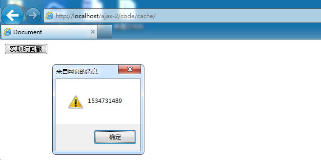
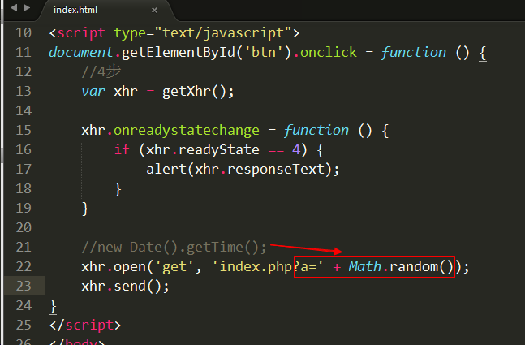

# GET缓存

## 什么是缓存？

 浏览器的请求需要从服务器获得许多 css、img、js 等相关的文件，如果每次请求都把相关的资源文件加载一次，对 带宽、服务器资源、用户等待时间 都有严重的损耗。如果浏览器将css、img、js等文件在第一次请求成功后就保存在本机上，以后的每次请求就在本机获得相关的资源文件，那么就可以明显地加快用户的访问速度，同时可以节省各种资源(带宽、服务器资源、用户等待时间)。

## GET缓存测试

 ajax方式，get会有缓存问题。

 案例:

   index.html页面中创建一个按钮，点击该按钮时发送ajax请求，得到后端php程序返回的当前时间戳并显示。

  目标:  点击“获取时间戳”按钮时，触发ajax请求，访问后端的getTime.php文件，得到时间戳并弹出显示

1. index.html --- 发送请求

index.php --- 输出当前时间戳即可。

 在IE下测试:

 

 显示的时间戳永远都是这个，说明是缓存问题。

  解决方法

  解决方法有两种:

  1) 前端方案:  在open准备ajax请求时，为请求的地址增加随机后缀。相当于每次请求都是新的地址

  2) 后端方案:  后端程序设置不允许缓存的头信息，php程序固定使用如下3句即可。

            header('cache-controller:no-cache');

            header('Pragam:no-cache');
            
            header('Expires:-1');

1) 前端方案:

2) 后端解决方案:

        header('cache-controller:no-cache');
        
        header('Pragam:no-cache');

        header('Expires:-1');

