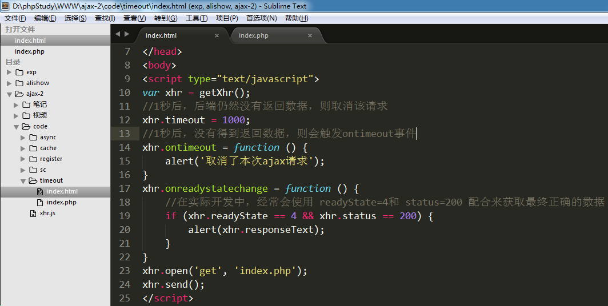

# XMLHttpRequest2.0新特性

## timeout 和 ontimeout

 timeout： 请求超时设置。属性，用来设置等待响应时长，如果超过指定时长，则会触发ontimeout事件

	xhr.timeout = 3000;    // 设置等待时长为3秒

  ontimeout： 事件，用来设置超过等待时长后的动作

        xhr.ontimeout = function () {

		alert('请求超时');

        }

在创建xhr对象之后，来设置timeout属性；如果设置了timeout属性，那么就建议设置ontimeout事件。

## FormData表单对象

小案例:  点击button按钮时，将用户名和密码值通过ajax发送到后端php页面

FormData对象优势就是能够一次性将表单中的所有数据全部取出，包括文件域的文件对象。

1)创建表单 --- form标签很重要， method和action不重要

   每个表单域需要设置name值

2)发送ajax请求

①将表单数据取出 --- FormData

i.获取form表单对象:        var fm = document.getElementById(‘mainForm’);  //DOM对象

ii.实例化FormData对象:  var fd = new FormData(fm);

②发送ajax请求

   使用FormData对象以后，必须使用post方式来发送ajax请求。

   将FormData对象，作为参数传入 send方法中  xhr.send(fd);

③ 使用FormData对象提交表单时，不需要设置 setRequestHeader方法

注意点: 

   ① form标签要给id值，方便获取form标签的DOM对象

   ② 每个域都要给 name值

   ③ 提交按钮必须用 button，因为submit有跳转功能

代码实现:

1) 使用FormData对象获取所有表单的数据，并发送ajax请求

2) 在formdata.php页面，接收数据

访问结果:

FormData的内部构造:  key-value

