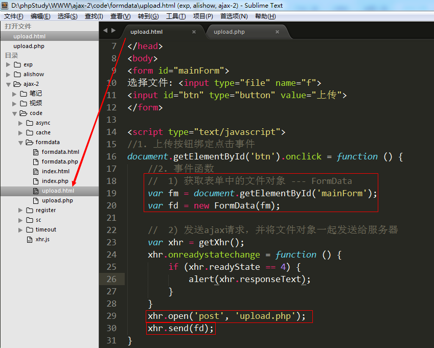
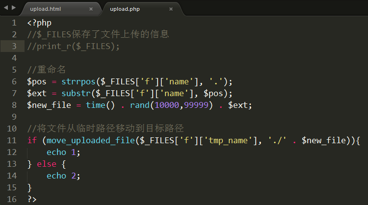
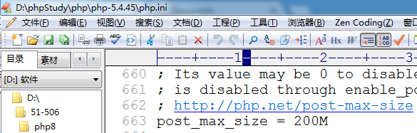
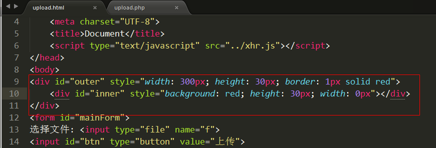

# 文件上传与进度条

 1) 完成Ajax文件上传

    核心: Ajax方式上传文件必须使用FormData对象

    关键点:  

        ① 表单使用提交按钮，一定是button
        ② 获取文件对象 ---- FormData
            i.根据id获取form表单对象 ---- DOM
            ii. 实例化 FormData对象，将表单对象作为参数传入
        iii. 因为使用了FormData，所以一定要用post方式发送请求，将fd作为参数传入send方法

 upload.html

    获取文件数据，发送ajax请求

upload.php 

2) 调整php配置文件（php.ini），使其支持大文件上传

① 修改允许上传文件最大的大小

② 修改post表单提交数据的最大大小

重启Apache服务器。

3) 文件进度条

① 在页面上设置一个div，用来表示进度条

  

② 根据实际上传百分比来绘制进度条的宽度

        核心:  xhr对象中有一个子对象（upload），upload对象中有一个事件 onprogress。该事件大约每100ms执行一次，里面有两个重要属性  loaded(已上传大小)    total（总大小）
