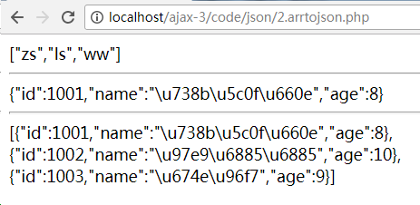
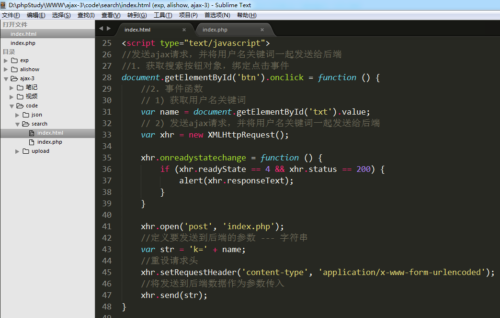
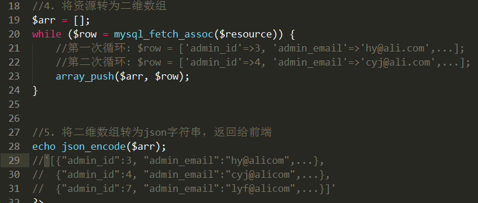

# JSON

## 什么是JSON？

JSON:  JavaScript Object Notation 是一种轻量级数据交互格式。  


数据交互: 每一种语言的编码都不一样，它们之间互不认识。但是现在的情况是不同的语言开发出的系统也需要进行数据交互，这时候就需要一种大家都认识的语言或者技术来实现。


xml: 扩展标记语言

## JSON数据的声明和使用

        声明:  var json_obj = {"key1":"value1", "key2":"value2", ...};

        key: 双引号包含的字符串

        value: 数据--数值型、字符串、数组、json对象

```php
        //key：必须用双引号
        var json1 = {"a":"Hello", "b":"world"};
        alert(json1.a);

        var json2 = {
            "name": "郭德纲",
            "age": 50,
            "tudi": ['岳云鹏', '烧饼', '张云雷'],
            "son": {"name":"郭麒麟", "age":20}
        };
        alert(json2.name);
        alert(json2.tudi[1]);
        alert(json2.son.name);

        //数组，内部的每个单元都是一个json
        var json3 = [
            {"name":"赵四",   "age":50},
            {"name":"小沈阳", "age":46},
            {"name":"刘能",   "age":50},
            {"name":"宋小宝", "age":52},
        ];
        alert(json3[2].name);
```

JSON的本质:  JSON 是 JS 对象的字符串表示法，它使用文本表示一个 JS 对象的信息，本质是一个字符串。

```php
var obj = {a:"hello", b:"world"};       // js对象

var obj = {"a":"hello", "b":"world"};    // json格式的js对象，也可以叫json对象 (JSON才是真正的JSON对象)

var str = '{"a":"hello", "b":"world"}';    // json，也叫json格式的字符串 必须外层单引号，内存双引号

var str = "{'a':'Hello', 'b':'world'}";  //错误，不能这样写，会影响到其他程序的执行

```


## PHP数组转JSON格式的字符串


php提供了函数：  json_str  json_encode($arr);

案例1: 索引数组转JSON  --->  数组

案例2: 关联数组转 JSON  --->  json对象

案例3: 二维数组转JSON  --->  一维数组，每个单元都是一个json对象


```php
        //索引数组
        $arr = ['zs', 'ls', 'ww'];
        // 一个索引数组被json_encode之后仍然是一个数组，
        // 但是是一个字符串形式数组
        echo json_encode($arr); // '["zs", "ls", "ww"]'

        echo "<hr>";

        //关联数组
        $info = ['id'=>1001, 'name'=>'王小明', 'age'=>8];
        // 一维关联数组被json_encode之后是一个json字符串
        echo json_encode($info); // '{"id":1001, "name":"王小明", "age":8}'

        echo "<hr>";

        //二维数组
        $list = [
            ['id'=>1001, 'name'=>'王小明', 'age'=>8],
            ['id'=>1002, 'name'=>'韩梅梅', 'age'=>10],
            ['id'=>1003, 'name'=>'李雷', 'age'=>9]
        ];
        // 二维数组，会转为数组，内部的每个单元都是json
        echo json_encode($list);
        /*
        '[
            {"id":1001,"name":"王小明","age":8},
            {"id":1002,"name":"韩梅梅","age":10},
            {"id":1003,"name":"李雷","age":9},
        ]'
        */
```


执行结果:



## JSON字符串转JSON对象 --- javascript代码

前端的ajax请求，最后接收到的都是字符串 --- responseText，以字符串形式接收后端返回的数据

var a = '[{"id":10001,"name":"zs","age":20},{"id":10002,"name":"ls","age":21},{"id":10003,"name":"ww","age":19}]'


json格式的字符串转为json对象:  JSON.parse(json_str); 

参数: json格式的字符串

```php
        var s = '{"id":1001,"name":"王小明","age":8}';
        alert(s.name);

        //将json格式字符串转为json
        var json = JSON.parse(s);
        alert(json.name);


        var arr = '[{"id":1001,"name":"\u738b\u5c0f\u660e","age":8},{"id":1002,"name":"\u97e9\u6885\u6885","age":10},{"id":1003,"name":"\u674e\u96f7","age":9}]';
        alert(arr[1]);

        var arr1 = JSON.parse(arr);
        console.log(arr1[1]);

```

## 案例 --- 搜索用户名，显示用户列表信息


思路:

1) 创建一个搜索页面，定义好搜索框，表头。在搜索按钮上绑定点击事件。

2) 点击事件能够发送ajax请求，并将用户名文本框中的内容一起发送到后端php程序

3) 后端php程序接收用户名，链接MySQL进行模糊查询，再将数组返回给前端

4) 前端接收到后端php返回值之后，循环显示出来


代码实现 : 

1) 创建一个搜索页面，定义好搜索框，表头。在搜索按钮上绑定点击事件。

 页面布局:

 


2) 点击事件能够发送ajax请求，并将用户名文本框中的内容一起发送到后端php程序

在搜索按钮上绑定点击事件 --- 获取文本框中的用户名，发送ajax请求





3) 后端php程序接收用户名，链接MySQL进行模糊查询，再将数组返回给前端

  核心操作: 将资源转为二维数组，再将二维数组转为json字符串，再返回给前端





4) 前端接收到后端php返回值之后，循环显示出来

