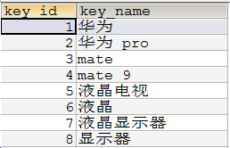
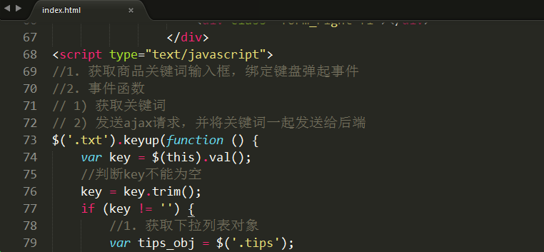
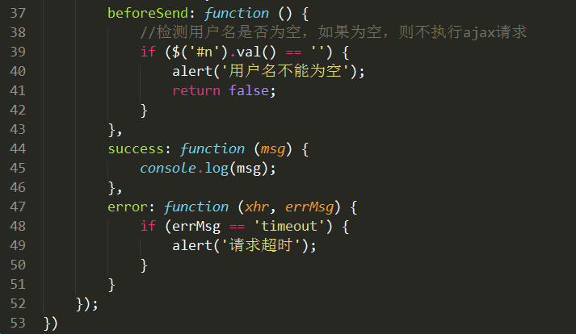

# jQuery提供的Ajax方法

 jQuery提供了4个ajax方法:  $.get()  $.post()  $.ajax()  $.getJSON()

 前三个常用


## $.get

$.get(var1, var2, var3, var4);

  参数1: 请求的后端程序的地址

  参数2: 要发送到后端程序的数据，json对象/js对象（推荐）或者 字符串

  参数3: 当readyState==4时的触发函数，该函数中有一个参数，就是后端程序返回的数据

  参数4: 设置返回数据的类型:  text(默认)  json     xml


案例: 在get.html文件中发送一个ajax请求，去请求后端的get.php页面，同时将id=1数据发送给后端

示例: 

```php
        $.get('get.php', {"goods_id":10101, "_":Math.random()}, function(msg){
            alert(msg);
        }, 'json');
```

解析:   上面的代码等价于原生js的

```php
        var xhr = new XMLHttpRequest();
        xhr.onreadystatechange = function(){
            if(xhr.readyState == 4){
                msg = xhr.responseText;
                msg = JSON.parse(msg);
                alert(msg);
            }
        }
        xhr.open('get', 'getData.php?goods_id=10101&_='+Math.random());
        xhr.send(null);

```

使用jquery提供的ajax方法，就是为了简化开发。

使用 $.get 改造 1.5的搜索案例

1) 表格和文本框一样


2) $.get发送请求


## $.post

$.post函数的用法和$.get一模一样，只是发送请求方式变为post

 $.post(var1, var2, var3 , var4);    //最标准的写法

  参数1: 请求的后台程序的地址

  参数2: 要发送到后台程序的数据，json对象/js对象（推荐） 或者 字符串

  参数3: 当readyState=4时的触发函数，该函数中有一个参数，就是后台程序返回的数据

  参数4: 设置返回数据的类型:  text(默认)  json     xml


示例: 

```php
        $.post('getData.php', {"goods_id":10101}, function(msg){
            alert(msg);
        }, 'json');
```

解析:   上面的代码等价于原生js的

```php
            var xhr = new XMLHttpRequest();
            xhr.onreadystatechange = function(){
                if(xhr.readyState == 4){
                    msg = xhr.responseText;
                    msg = JSON.parse(msg);
                    alert(msg);
                }
            }
            xhr.open('post', 'getData.php');
            var param = 'goods_id=10101';
            xhr.setRequestHeader('content-type', 'application/x-www-form-urlencoded');
            xhr.send(param);
```

## 案例 --- 搜索框下拉列表


数据表设计:





key_id: 主键

key_name: 关键词


 思路分析:

1. index.html  ---  在搜索框上绑定keyup事件，获取搜索框内容并发送ajax请求
   1) 在搜索文本框上绑定键盘弹起事件
   2) 事件函数
      ① 获取搜索框内容
      ② 发送ajax请求，等待结果

1. getKeys.php ---  接收关键词，并根据关键词从数据表中查出相关的其他关键词，返回给前端
   1) 接收关键词
   2) 编写SQL语句，查询和接收关键词相关的所有关键词
   3) 将查询结果返回给前端

1. index.html --- 将接收到关键词循环显示到下拉列表（tips）中
   接收后端返回结果并显示
   1) 制作下拉列表
   2) 将后端返回的每条关键词都填充到下拉列表中
   3) 完善下拉列表
      ① 每次循环取出关键词时都先创建div，并将关键词放在div中
      ② 为div绑定鼠标悬浮事件（高亮显示）和鼠标移出事件（取消高亮显示）
      ③ 为div绑定点击事件，将选中的关键词放入搜索框
      ④ 将每个div都放入tips
      ⑤ 将tips显示出来
      ⑥ 每次向tips中填充数据时，都要先清空tips
   

代码实现:

index.html  ---  在搜索框上绑定keyup事件，获取搜索框内容并发送ajax请求

1) 在搜索文本框上绑定键盘弹起事件

2) 事件函数

   ① 获取搜索框内容

   ② 发送ajax请求，等待结果


getKeys.php ---  接收关键词，并根据关键词从数据表中查出相关的其他关键词，返回给前端

1) 接收关键词

2) 编写SQL语句，查询和接收关键词相关的所有关键词

3) 将查询结果返回给前端


下拉列表


index.html 将结果显示到下拉菜单中





关键点总结:

1) 使用键盘弹起事件来触发ajax请求

   ① 获取搜索框中的内容

   ② 发送ajax请求，并将搜索框中的内容一起发送给后端

2) 接收到的数据需要循环显示在下拉菜单中

   ① 将返回的字符串转为数组（内部是json对象）

   ② 循环数组，取出每一个相似关键词

   ③ 在循环中创建div对象，将关键词加入div对象

   ④ 在div上绑定鼠标悬浮事件，修改背景和字体颜色

   ⑤ 在div上绑定鼠标移出事件，修改背景和字体颜色为初始颜色

   ⑥ 在div上绑定点击事件，将内容写在搜索框中，并隐藏下拉列表

   ⑦ 将div追加到下拉列表中，然后再将下拉列表显示出来

   ⑧  在循环显示下拉列表之前先清空下拉列表中已有内容


## $.ajax方法


$.ajax使用JS对象来配置ajax请求  ---  $.ajax(obj);

 必须配置项：

> url:         要请求的后台程序地址

> data:      要发送到后台程序的数据 (建议使用json/js对象格式，也可以使用字符串，也可以是FormData)

>type:      请求类型  post和get 两种  (put、delete)

> dataType:  返回值类型  text(默认) 、 json 、xml 、 jsonp(跨域使用) 

> success:   成功完成ajax触发的事件，回调函数，其参数是后端程序的返回数据


简单案例:

1) 发送ajax请求


2) 后端返回数据

 

 其他配置项：

> cache: 是否进行缓存(true/fasle)，如果设置type为get，一般设置该项为false(不缓存)。

> async: 同步/异步设置，true(异步、默认) false(同步)。

> timeout: 超时设置，多少ms之后扔未接收到后端返回数据，则结束本次请求。--- 进入error方法中

> error: 请求失败时的回调函数，该函数有三个参数。参数1是xhr对象，参数2是错误信息（错误信息通常是 "null", "timeout", "error", "not modified" 和 "parsererror"），参数3是异常对象（可选）。

> complete: Ajax完成时的回调函数。不论请求成功还是失败都会执行该方法

> beforeSend: 发送Ajax之前执行的回调函数。

> beforeSend()  --->  success/error()  ---> complete()

> contentType:  头信息设置，使用FormData对象时设置该值为false，其他情况会自动设置，不需要手动设置。

> processData:  处理数据方式，使用FormData对象时设置该值为false，其他情况会自动设置，不需要手动设置。

  注意: **contentType和processData只有在使用FormData对象时，设置为false，其余情况均不用设置**


## 案例 ---  添加新管理员


如果发送的数据是FormData，那么就只能使用原生js 或者 $.ajax

  $.ajax发送请求时，如果发送的数据是FormData时，必须设置 contentType和processData为false

  1) 表单页(index.html)

       提交按钮上，绑定点击事件，获取表单数据，发送ajax请求

  2) php页面接收表单数据，拼接SQL语句并执行 

  3) 前端接收结果，进行提示


代码实现:

1) 表单页(index.html)

    提交按钮上，绑定点击事件，获取表单数据，发送ajax请求

     因为用到FormData来获取表单数据，所以必须用$.ajax，发送请求时要额外配置contentType和processData




2) php页面接收表单数据，拼接SQL语句并执行  （自己完成）

3) 前端接收结果，进行提示


