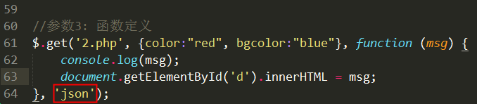
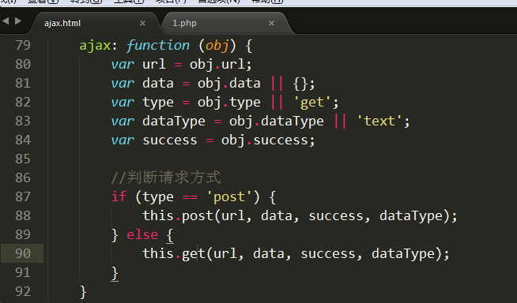

# 封装方法

从一般到通用。

从一个具体的案例，完善成一个兼容相同功能函数

  1) 编写一个具体案例

  2) 分析其中的缺陷

  3) 完善缺陷

## 封装 $.get方法

1) 编写一个具体的案例

   具体案例:  封装一个get方法，能够发送ajax请求，请求1.php文件，并且能接收到1.php的返回数据

  ① 使用原生js完成整个ajax请求过程

  ② 定义$对象，再定义get成员方法

**分析具体案例存在的问题，一步一步将存在问题修正，就能够形成一个通用的函数了。**

具体案例存在的问题:

① 在创建XMLHttpRequest对象时，没有处理浏览器兼容性

② 只能访问1.php程序

③ 无法灵活向后台的1.php程序发送参数

④ 前端无法灵活接收后端返回的数据

⑤ 返回值类型单一，只能使用字符串

2) 处理创建XMLHttpRequest对象时的兼容性问题

3) 处理只能访问1.php文件的文件的问题。

  思路: 定义get函数时设置形参，调用函数时传递实参

① 修改get方法，设置参数1 --- 请求的url地址

② $调用get方法时，需要传递实参

4) 处理请求后台文件时无法发送数据 

  思路: 将js对象组装为字符串，拼接在请求的url地址之后

 $.get('1.php', {"id":1, "name":"zs"} , ....)  --> 1.php?id=1&name=zs

 本质: {"id":1, "name":"zs"} ---> id=1&name=zs

 

① 封装params方法，将js对象转为字符串

 i. 创建了一个test.html页面，用来测试js对象转字符串的方法

 ii. 将封装好的函数加入到 $ 对象中

② 在get方法中定义参数2， 并在get方法中调用params方法，将参数2的js对象转为字符串，将字符串参数拼接到url地址当中

5) 处理readyState==4时的回调函数

① 在$.get方法中设置参数3，在方法体中使用函数形式调用，就相当于执行了一个函数

② 在调用$.get方法时，以回调函数形式传入参数3

6) 处理能够接收不同类型的返回值

① 在$.get方法声明时，设置参数4，判断参数4的值，如果是json则进行额外处理

② 在调用$.get方法时，传入参数4

## 封装 $.post方法

 1) 创建post方法，能够发送ajax请求

 2) 处理向后台发送的数据

 3) 处理回调函数和返回值类型
  

    1) 封装普通的方法

    2) 处理xhr的浏览器兼容性问题

    3) 请求地址参数问题

    4) 让请求能够发送数据

    5) 回调函数

    6) 设置返回值类型

## 封装 $.ajax方法

核心思想:

1) 将发送请求的地址、方式、数据、返回值类型、回调函数都封装到js对象中，然后作为参数传入$.ajax方法中。

2) 在$.ajax方法中区分post和get方式，分别调用get方法和post方法。

