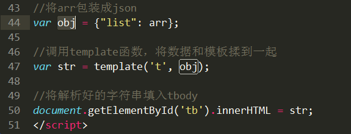
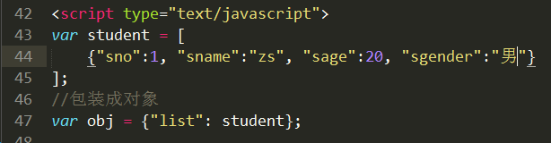
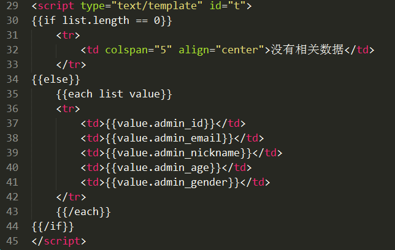
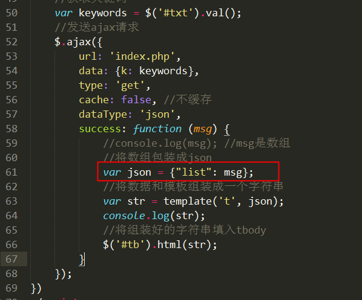

# 模板引擎

## 为什么要使用模板引擎

通过搜索用户名案例我们发现，要渲染到网页上的数据是使用js循环拼接字符串，再将拼接好的字符串填入tbody标签中的。

   这种方式可读性差，出错不容易查找。

   模板引擎技术就是为了解决字符串拼接问题的。 ==模板引擎技术本质就是拼接字符串。==

   传统模式有两种拼接显示字符串的方式:

- 在后端程序中拼接好，然后以字符串形式返回
- 后端程序返回json字符串，前端程序接收了之后，解析json进行拼接

模板引擎方式：


模板引擎属于前端程序拼接字符串
提前定义好要显示格式，所有数据位置以特殊标记表示出来。模板引擎会自动分析，并将数据填写到对应的位置。

我叫__ , 今年__ 岁了


##  常见模板引擎

ArtTemplate：https://github.com/aui/artTemplate

velocity.js：https://github.com/shepherdwind/velocity.js

Handlebars：http://handlebarsjs.com


## artTemplate快速上手

基本使用步骤:

  1) 使用script标签引入arttemplate库文件 (template-web.js)

  2) 定义标签，用来显示最终解析好的模板信息

  3) 定义模板和模板中所需数据。


            ① 定义要显示在模板中的数据，必须是 json 对象
            ② 使用script标签定义模板，type="text/template"  id="tpl"，并且使用 {{}}  将所有数据位置标记出来
        
  4) 调用template函数，解析模板，将数据和模板组装到一起

  5) 将解析好的模板字符串填充到事先定义好的标签中(显示到网页上)


简单案例：拼接模板字符串 “我叫张三，今年20岁”，并输出在网页的div中

模板:   我叫__ , 今年__ 岁了

var json = {"name":"zs", "age":20};


① 引入 template-web.js库文件

② 定义标签，用来显示最终解析好的模板信息

③ 定义数据和模板

④ 调用template函数将数据和模板揉到一起

⑤ 将解析好的字符串写入定义好的标签中


关键点：

1) 在定义模板时使用 script 标签， type=“text/==template==”  id="tpl"

2) 定义json对象，json对象中的key一定要和模板中的 {{key}}一致

3) 调用template函数进行解析

        参数1: 模板的id值
        参数2: json对象


## 循环结构 --- each


关键点: 

1) template函数需要的参数是一个json对象，所以需要声明json对象，里面是数组

2) 在定义模板时使用each进行循环

  each结构:   

  {{each data as value}}

	输出内容

  {{/each}}

  data: 要循环的数组

  value: 循环取出的单元值

  注意: 使用 {{/each}} 结束循环


① 使用script标签引入arttemplate库文件 (template-web.js)

② 定义标签，显示最终结果的标签

③ 定义数据和模板

④ 调用template函数，将数组和模板进行解析

⑤ 将解析好的字符串显示到div中





```php
var  arr= [

	{"name":"zs", "age":20},

	{"name":"ls", "age":20},

	{"name":"ww", "age":20},

]


var arr = [

	{"sno":1, "sname":"aaa", "sage":20, "sgender":"nv", "semail":"dasdsad@d.acom", "stel":"12134333"},

	{"sno":2, "sname":"aaa", "sage":20, "sgender":"nv", "semail":"dasdsad@d.acom", "stel":"12134333"},

	{"sno":3, "sname":"aaa", "sage":20, "sgender":"nv", "semail":"dasdsad@d.acom", "stel":"12134333"},

]

```

## 选择结构 --- if else

关键点: 定义模板时使用 

  {{if  判断条件}}

	程序块1

  {{else}}

	程序块2

  {{/if}}


定义数据和模板





## 使用模板引擎改造搜索用户案例

目标: 使用模板引擎来代替原来的字符串拼接


① 引入库文件

② 定义标签，显示最终结果的标签

③ 定义数据和模板

④ 调用template函数

⑤ 将解析好的字符串渲染到tbody中


1) 发送ajax请求


2) 后端php接收关键词，查询，再将结果返回给前端

3) 前端显示数据 --- 模板引擎

   ① 引入 template-web.js 文件

   ② 定义显示最终结果的标签 -- tbody

   ③ 定义数据和模板

       数据后端返回的 ---  数组，内部是json

       需要包装成json

       定义模板： each循环json中的数组，还可以增加if判断

    ④ 调用template函数组装数据和模板

    ⑤ 将结果显示到 tbody中

  

定义模板:



定义数据：




 ## 模板引擎原理简介
 

 核心原理: 使用正则替换模板引擎中的标记

 例如: 我叫{{name}}，今年{{age}}岁

  使用正则表达式找到模板字符串中的{{name}}和{{age}},再用真实的数据进行替换。

 核心方法:  

  ① reg.exec(str);

  reg: 正则表达式

  str:  字符串

  函数作用: 从str字符串中找到复合reg正则表达式的对象，如果没有则返回null

  ② str.replace(str1, str2);

  函数作用: 在str字符串中找到str1字符串，然后用str2字符串进行替换

  例如:

  str = “abcdefg”;

  str1 = “bc”;

  str2 = “zs”;

  console.log(str.replace(str1, str2)); //  azsdefg

  掌控每一步中变量的内容。
