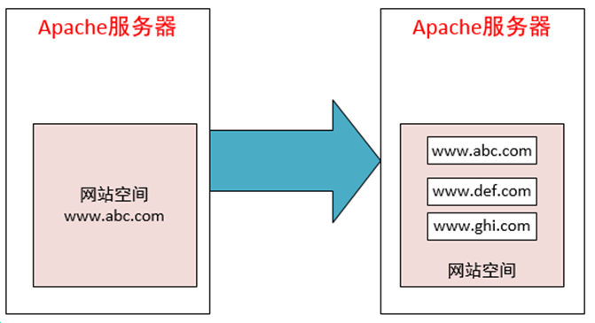
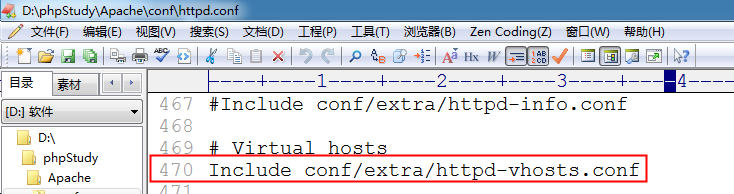

# 虚拟主机配置

## 什么是虚拟主机

虚拟主机，也叫“网站空间”，就是把一台运行在互联网上的物理服务器划分成多个“虚拟”服务器，每一个虚拟服务器都能独立运行一个网站

## 虚拟主机配置3步骤

目标: 将我们的apache做成虚拟主机，同时支持多个网站。  还可以为每个虚拟主机自定义域名

www.study.com

案例: 配置 www.study.com  虚拟主机

1) 修改apache配置文件(httpd.conf)，引入apache的虚拟主机配置文件(httpd-vhost.conf)

     去掉该句前的 # 号

2) 修改虚拟主机配置文件

d:\phpstudy\Apache\conf\extra\httpd-vhosts.conf

3) 修改hosts文件 (使用管理员权限修改)

c:/windows/system32/drivers/etc/hosts

在浏览器中输入 www.study.com 就会访问本机的apache服务器

**重启Apche服务器**

注意：  www.study.com 指向  d:/phpstudy/WWW/study 目录

 配置两个域名：  www.study.com   www.demo.com
