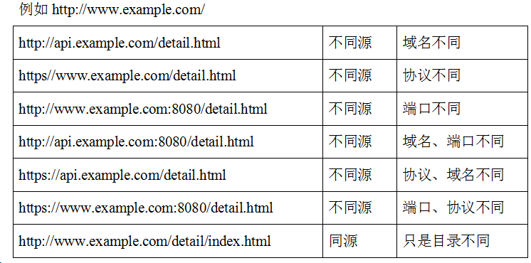
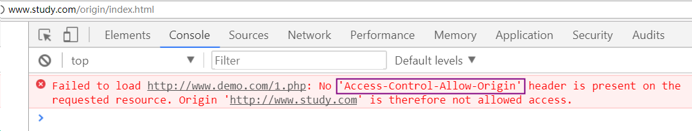
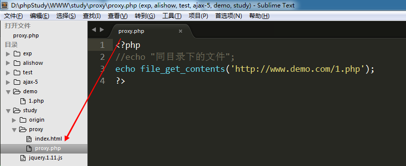
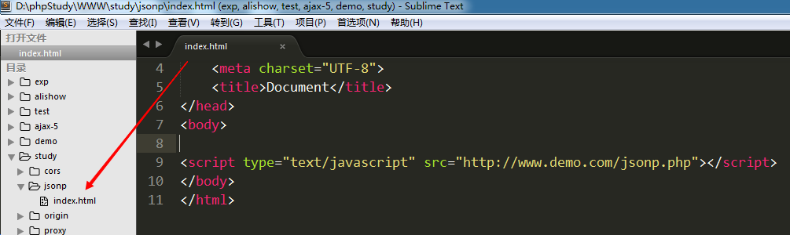
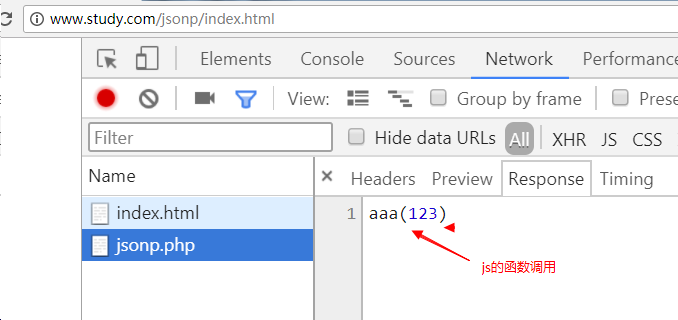
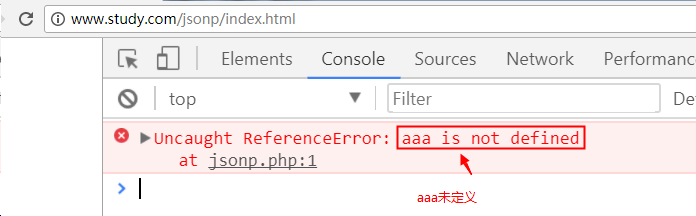
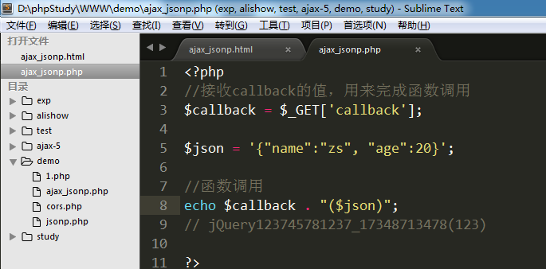
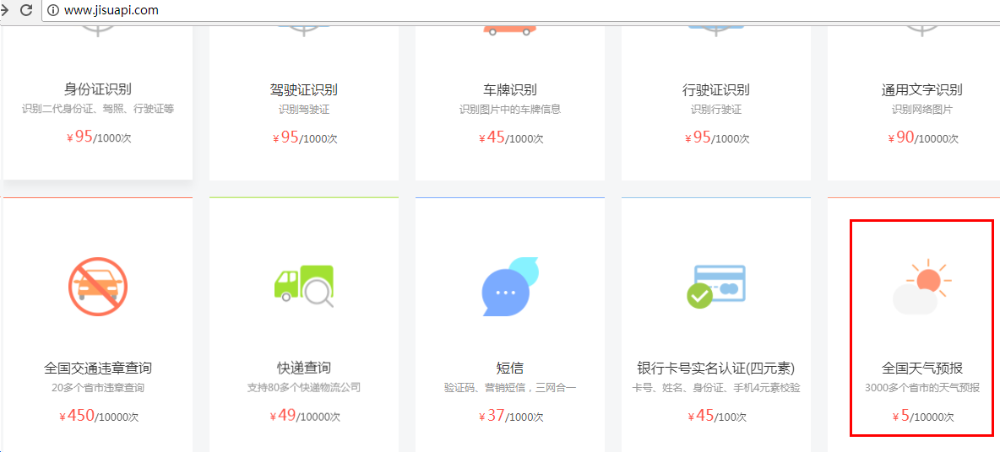
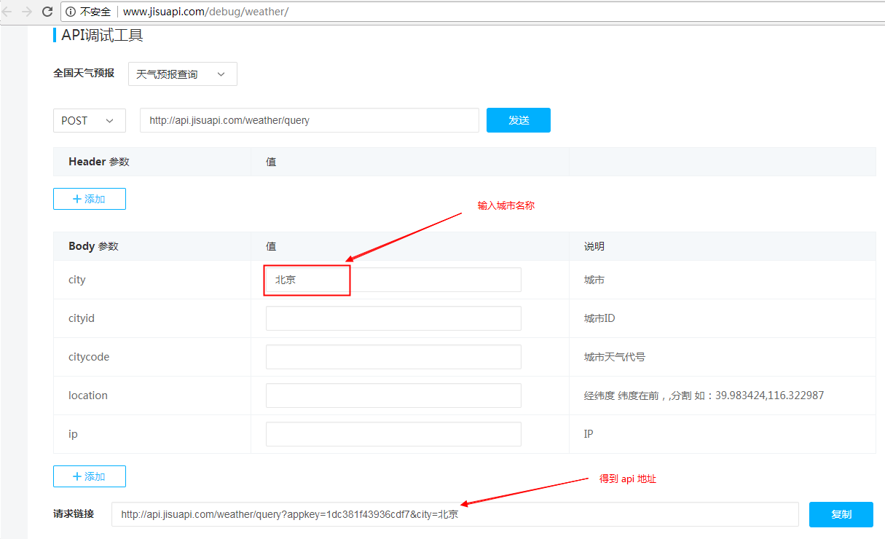

# ajax跨域

## 什么是ajax跨域

简单来说，就是网站A去调用网站B的数据。

常见案例： hao123.com的天气预报。

但是Ajax跨域存在一个问题 --- 浏览器的同源策略，该策略会阻止ajax跨域访问

同源策略（Same origin policy）是一种约定，它是浏览器的一种安全功能。 

同源:  同协议，同域名，同端口；   不同源则为跨域

同源限制案例:

www.study.com/origin/index.html使用ajax，请求www.demo.com/1.php文件中的数据

1) 创建 www.study.com/origin/index.html 文件

2) 创建 www.demo.com/1.php

访问结果:

 响应主体: 

 

  终端：

看到 Access-Control-Allow-Origin 错误，就说明正在执行跨域请求，请求数据被浏览器的同源策略所阻止。

解决跨域问题有三种方式：

- 服务器代理
- cors （跨域资源共享）
- jsonp

##  代理实现ajax跨域

核心思想:  php中有一个函数  **file_get_contents**。 该函数能够获取到其他网站的数据。

  file_get_contents('http://www.baidu.com/index.html');

案例: 

www.study.com/proxy/index.html发送ajax请求，请求www.study.com/proxy/proxy.php文件

proxy.php文件使用file_get_contents函数读取www.demo.com/1.php文件中的内容，再返回给index.html文件中的ajax请求

1)创建  www.study.com/proxy/index.html

     在该文件中发送ajax请求，请求同服务器(www.study.com)下的 proxy.php文件

2)创建  www.study.com/proxy/proxy.php 

    在该文件中使用 file_get_contents函数，读取远程服务器(www.demo.com)1.php中的内容

3)创建  www.demo.com/1.php

访问结果:

## cors跨域

cors: 跨域资源共享。

  同源策略是浏览器的策略。但是如果服务器允许其他网站的页面进行跨域访问，那么浏览器就不会对返回的数据进行限制了。

  **核心方法: 在服务器端(PHP文件中)声明不用进行同源限制**

如果设置为 * 则是所有外部网站都可以获取数据

header('Access-Control-Allow-origin: *'); 

只允许www.study.com网站访问并获取数据

header('Access-Control-Allow-origin: http://www.study.com'); 

案例:

www.study.com/cors/index.html通过cors方式，访问www.demo.com/cors.php文件的数据	

1)创建 www.study.com/cors/index.html文件 发送ajax请求

2)创建 www.demo.com/cors.php

## jsonp跨域

JSONP(JSON with Padding) : 是一种解决ajax跨域访问的方案。

核心思想:

   浏览器虽然有同源策略，但是 src 和 href 两个属性却可以跨域访问。 可以利用这一“漏洞”发送ajax请求。

案例: 

www.study.com/jsonp/index.html文件中通过script标签的src属性，跨域访问www.demo.com/jsonp.php文件中的数据

1) 创建 www.study.com/json/index.html ,使用 script标签引入了  www.demo.com/jsonp.php文件

2) 创建 www.demo.com/jsonp.php文件 输出个 123

访问结果 --- 响应主体，拿到后端的返回值

3) 调整后台返回数据的方式 --- 返回了一个 **函数字符串 例如: 'aaa(123)'** 

访问结果: 

4) 在前端页面提前定义好 函数 aaa()

访问结果 --- 123被输出到终端

5) 丰富一下后台返回数据的类型

访问结果:

## $.ajax方法跨域操作 --- jsonp方式

        $.post $.get $.ajax都能发送跨域请求。
        但是，$.post和$.get是要依靠cors方式的，
        只有$.ajax能使用jsonp方式

核心: 

        必须设置请求类型为get ---  type: ‘get’
        必须设置dataType为jsonp --- dataType: ‘jsonp’
        必须额外设置一个jsonp参数，该参数值可以是任何英文字符串，常用callback。 jsonp: 'callback'
            该参数会产生一个随机字符串
            前端使用该字符串创建一个函数
            后端接收该字符串作为返回函数的名称

示例:

1) 使用jsonp发送跨域请求

        $.ajax({
            url: 'http://www.study.com/test/3.php',
            type: 'get',   
            dataType: 'jsonp',   
            jsonp: 'callback',  //解决前后端函数名统一的问题   
            success: function(msg){
                alert(msg);
                alert(msg.name);
            }
        })

2) 后端拼接函数字符串

        <?php 
        // 函数名
        $callback = $_GET['callback'];
        $str = "$.ajax--->jsonp";
        echo $callback . "('$str')";
        ?>

案例:

www.study.com/ajax_jsonp.html 跨域访问www.demo.com/ajax_jsonp.php文件中的内容

1)　创建 www.study.com/ajax_jsonp.html 发送ajax请求

2)　创建www.demo.com/ajax_jsonp.php 返回数据

## 调用网上接口 --- 天气预报

网站： www.jisuapi.com

api说明:

注册，购买后可在“我的api”中看到

1） 发送ajax请求

2) 将取得数据筛选后显示到网页上
